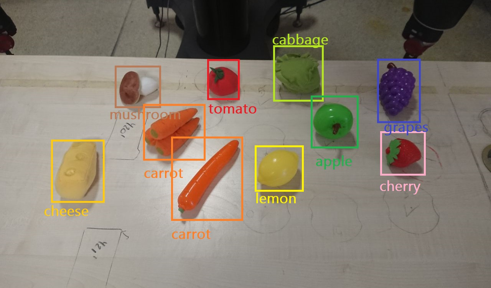

# Baxter-Robot-ObjDet
Repository for some experiments with Baxter robot and Object Detection.

The code allows the robot:
- to detect different objects,
- approach them with his arm, independently from their position on the table in front of it,
- pick them up safely and move them.

> The models of large size in the folder models can be downloaded from the [releases](https://github.com/igor-lirussi/Baxter-Robot-ObjDet/releases)

## Result

## Run
Please clone this repo with "recurse-submodules" option, or the submodules will be missing:
'''
git clone --recurse-submodules git@github.com:igor-lirussi/Baxter-Robot-ObjDet.git
'''
run '''python reach_obj_det_YoloV4.py --help''' for info on executing it.

### Jupyter Notebooks
The notebooks contain some examples of image processing with OpenCV and Pyhton.

The notebooks study both face detection and object-detection.

If it's not in the right path, open the notebook with Anaconda Propt passing the correct disk. Example:
'''
jupyter notebook --notebook-dir=D:
'''

### Colors Toys Object Detection Model
A Yolo v4 model has been trained to detect 9 different classes of food toys present in CoLoRs Lab. 

In the [releases](https://github.com/igor-lirussi/Baxter-Robot-ObjDet/releases) you can download:
- colors.names
- yolov4-colors.cfg
- yolov4-colors.weights

## Built With

* Python 3.7.18

## Changelog

**Version 1.0** - Initial release, 31-01-2022

**Version 1.1** - Added Colors yolov4 trained net, 28-09-2023

## Authors

* **Igor Lirussi** @ BOUN Boğaziçi University - CoLoRs Lab

## License

This project is licensed under License - see the [LICENSE](LICENSE) file for details
